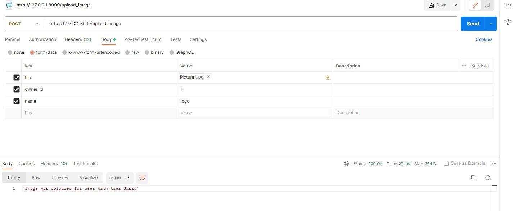
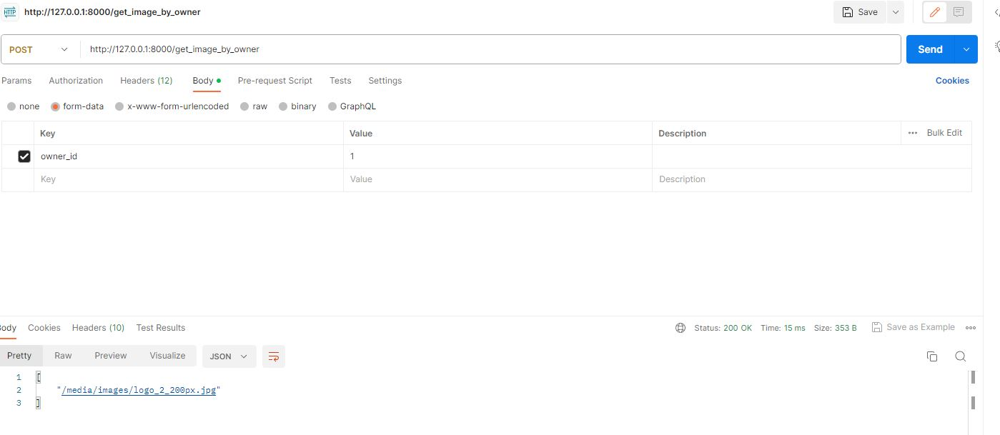
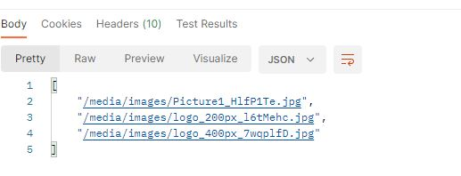
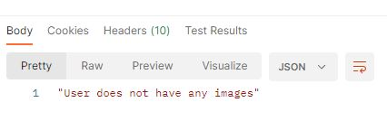

An application written in the Django Rest Framework for uploading images (jpg, png) by users. The application was written for a recruitment process.  Below are the abbreviated requirements of the task:
1. uploading images via HTTP request,
2. users should be able to list their images,
3. there are three builtin account tiers: Basic, Premium and Enterprise:
    users that have "Basic" plan after uploading an image get: 
    - a link to a thumbnail that's 200px in height
    users that have "Premium" plan get:
    - a link to a thumbnail that's 200px in height
    - a link to a thumbnail that's 400px in height
    - a link to the originally uploaded image
    users that have "Enterprise" plan get
    - a link to a thumbnail that's 200px in height
    - a link to a thumbnail that's 400px in height
    - a link to the originally uploaded image
    ability to fetch an expiring link to the image (the link expires after a given number of seconds (the user can specify any number between 300 and 30000))
4. part from the builtin tiers, admins should be able to create arbitrary tiers with the following things configurable:
    - arbitrary thumbnail sizes
    - presence of the link to the originally uploaded file
    - ability to generate expiring links
5. admin should be done via django-admin
6. more requirements: 
    - tests
    - validation
    - performance considerations (assume there can be a lot of images and the API is frequently accessed)

I met the requirements with two exceptions:
- no expired links,
- no tests  

Perhaps these requirements will be added in the next few days, but I wanted to give the task the stage it is at.

# Installation:
Docker:
1. Clone this repository: <code>git@github.com:Grzegorz-Oledzki/django-task.git</code>
2. Make sure you have docker
3. Type:
    <code>docker-compose -f docker-compose-dev.yml up -d --build</code>
    then:
4. When you have error with database type again command above
5. Run <code>docker-compose -f docker-compose-dev.yml exec web python manage.py createsuperuser</code>
6. To load builtin account tiers and create user connected to superuser:
    <code>docker-compose -f docker-compose-dev.yml exec web python manage.py loaddata task/builtin_tiers.json</code>
7. Enjoy! 

# How to use:
1. Via Postman post image with fields:
    - file,
    - owner_id,
    - name
    and if everything is ok you should get response like:
    
2. To get image, post owner_id:
    - Basic one thumbnail user without orginal link: 
    
    - Premium - two thumbnail and original link:
    
    - if user does not have images:
    

Thanks!